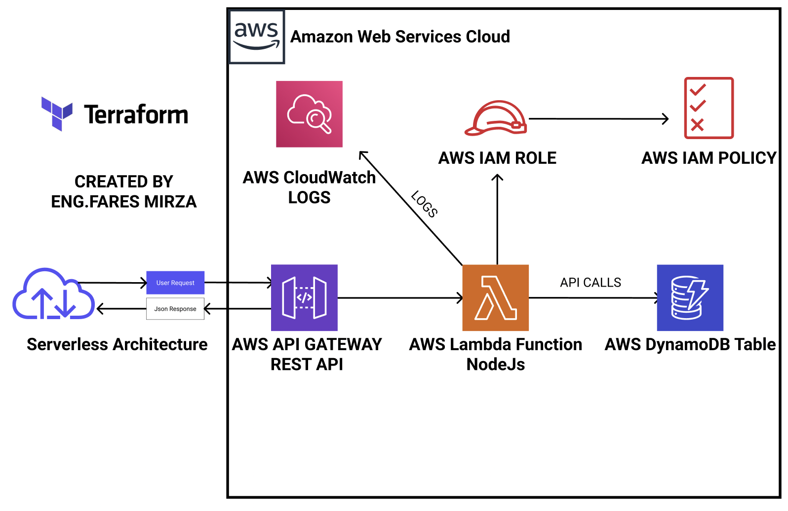

# Serverless AWS Deployment with Terraform

## Overview

This project automates the deployment of a serverless application on AWS using Terraform. It includes setting up a Lambda function, a DynamoDB table, an API Gateway, and necessary IAM roles and policies. The infrastructure is designed to be scalable and cost-effective, leveraging AWS's serverless architecture. The application is built using Express.js and runs on Node.js 20.

## Infrastructure Diagram



## Services Used

- **AWS Lambda**: For running serverless functions.
- **Amazon DynamoDB**: As a NoSQL database to store and retrieve data.
- **Amazon API Gateway**: To expose RESTful APIs for the Lambda function.
- **AWS IAM**: For managing access and permissions.
- **AWS CloudWatch**: For logging and monitoring.

## Prerequisites

Before you begin, ensure you have the following installed:

- [Terraform](https://www.terraform.io/downloads.html) (version >= 1.3.0)
- [AWS CLI](https://aws.amazon.com/cli/)
- Bash shell (for running the script)

## Setup Instructions

### Step 1: Clone the Repository

Clone this repository to your local machine:

```bash
git clone https://github.com/FaresMirza/aws-serverless-terraform
cd aws-serverless-terraform
```

### Step 2: Configure AWS Credentials

Ensure your AWS CLI is configured with the necessary credentials. You can configure it by running:

```bash
aws configure
```

Alternatively, you can provide the credentials directly in the script when prompted.

### Step 3: Run the Deployment Script

Execute the deployment script to set up the infrastructure:

```bash
bash script.sh
```

The script will prompt you to enter the following information:

- AWS Region
- Access Key ID
- Secret Access Key
- DynamoDB Table Name
- DynamoDB Hash Key
- Lambda Function Name
- API Gateway Name
- API Gateway Stage Name

### Step 4: Terraform Initialization and Deployment

The script will automatically initialize Terraform, plan the infrastructure changes, and apply them. This will create the necessary AWS resources.

## Project Structure

- `script.sh`: Bash script to gather user input and set environment variables for Terraform.
- `modules/`: Contains Terraform modules for AWS resources.
  - `aws_lambda/`: Module for deploying AWS Lambda functions.
  - `aws_dynamodb/`: Module for setting up DynamoDB tables.
  - `aws_iam/`: Module for IAM roles and policies.
  - `aws_apigateway/`: Module for API Gateway setup.
  - `aws_cloudwatch/`: Module for CloudWatch configuration.

## Usage

After deployment, you can interact with the AWS resources using the AWS Management Console or AWS CLI. The API Gateway endpoint will be available for invoking the Lambda function.

## Troubleshooting

- Ensure your AWS credentials are correct and have the necessary permissions.
- Check the Terraform logs for any errors during the deployment process.

## License

This project is licensed under the MIT License. See the [LICENSE](LICENSE) file for details.

## Contributing

Contributions are welcome! Please open an issue or submit a pull request for any improvements or bug fixes.

## Contact

For any questions or support, please contact Fares Mirza at faresmirz93@gmail.com.
